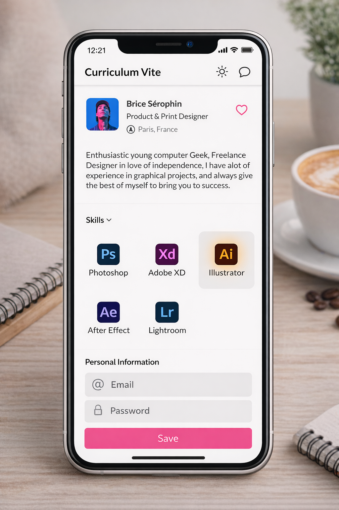
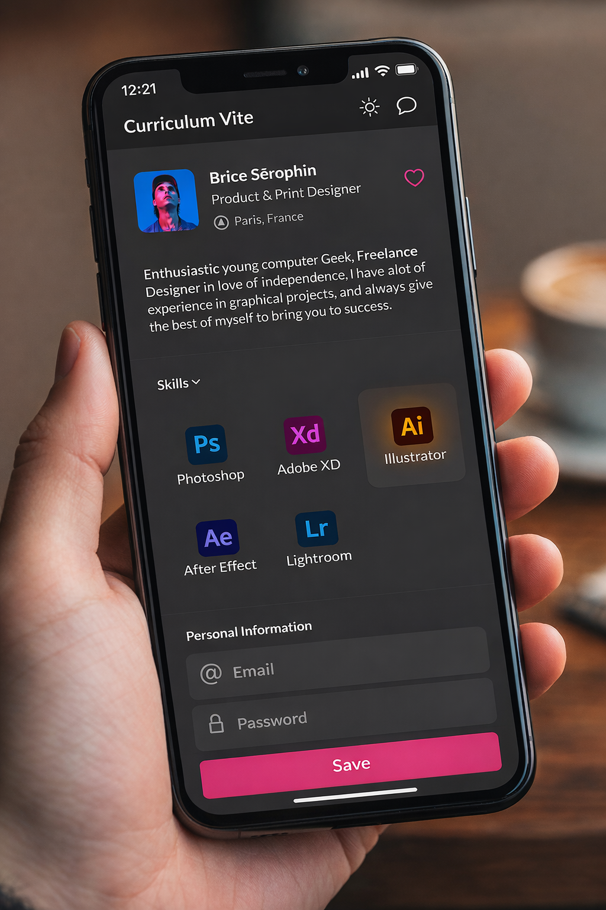

# 📱 Flutter Profile App

A simple and clean **Profile App** built with **Flutter**.
This is my **first Flutter project**, featuring a **Profile Screen** with **Dark & Light Theme** support.
This project has been created under the 7learn course flag, Thanks.

---

## ✨ Features

* 👤 Profile Screen UI
* 🌙 Dark Theme
* ☀️ Light Theme
* 🎨 Clean Material Design
* ⚡ Responsive Layout
* 🔠 I18n Support
* 🌐 Web & Mobile Support

---

## 📸 Screenshots

### ☀️ Light Theme



### 🌙 Dark Theme



---

## 🚀 Getting Started

### Clone Repository

```bash
git clone https://github.com/funnypar/profile_app.git
```

### Go to Project Folder

```bash
cd profile_app
```

### Install Dependencies

```bash
flutter pub get
```

### Run App

```bash
flutter run
```

---

## 🛠️ Built With

* Flutter
* Dart
* Material Design

---

## 📚 What I Learned

* Flutter Layout
* MaterialApp & Scaffold
* ThemeData
* Dark & Light Theme
* AppBar Customization
* Widget Structure


## 👨‍💻 Author

**Parsa Norouzi**

GitHub: https://github.com/funnypar

---

## ⭐ Support

If you like this project, please give it a ⭐ on GitHub!
